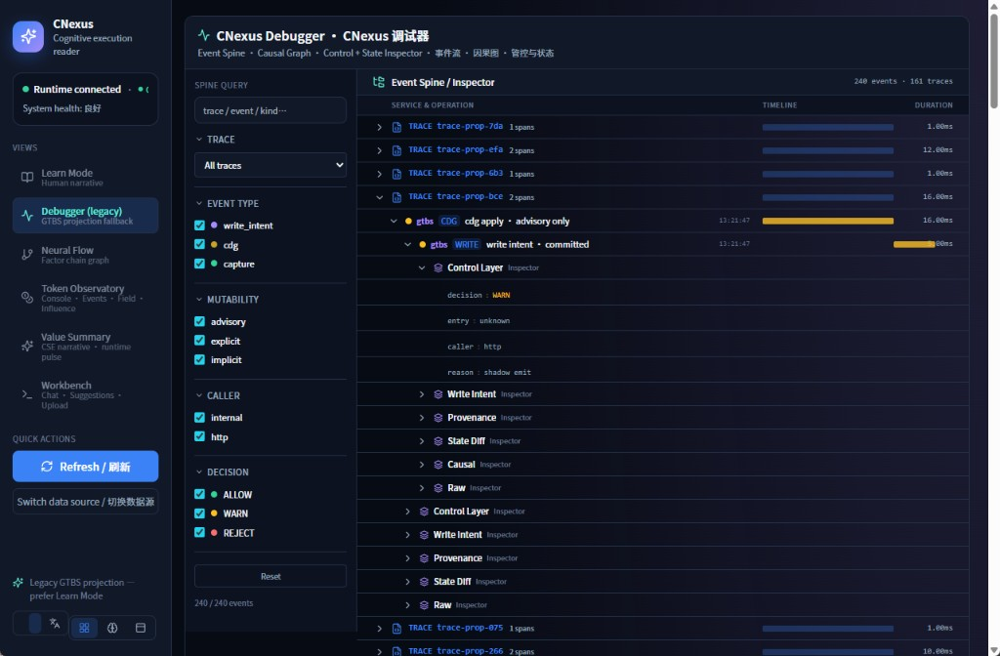
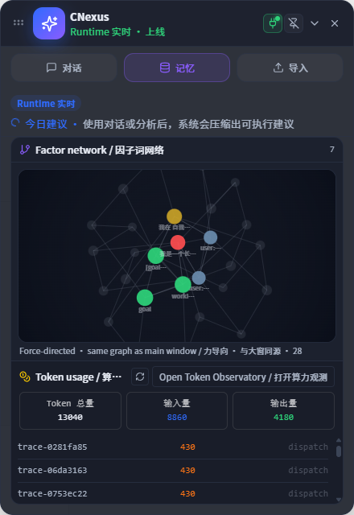

# CNexus

**Observational Cognition Platform for Long-Lived AI Agents**  
**Stability-First Continuity · Multi-Stream Semantic Inference**





---

CNexus is a cognitive runtime and observational cognition platform designed to give stateless LLM agents persistent identity, long-term memory, narrative continuity, and governed personality evolution — with a read-only L2 / L2.5 semantic stack over immutable observability streams.

Unlike traditional memory systems that only store conversation history, CNexus focuses on a deeper problem:

> How can an AI remain the same evolving entity across long-term interaction — while keeping cognition observable, interpretable, and non-actuating?

The platform introduces a Stability-First architecture that combines:

* Persistent Memory Infrastructure
* Personality DNA
* Narrative Self
* Belief Governance
* Drift Detection
* Identity Anchoring
* Constitutional Safety
* GTBS Observability + L2 Semantic Alignment (v0.1–v0.3 + L2.5)

CNexus separates:

* reasoning → handled by foundation models
* execution → handled by agent runtimes
* continuity → handled by CNexus cognitive runtime
* observational cognition → L2 / L2.5 interpretive layers (read-only)

Its mission is not to make AI "smarter", but to make AI:

* stable
* continuous
* governable
* persistent over time
* structurally observable

The system is designed for:

* long-lived AI agents
* personal AI companions
* autonomous runtimes
* persistent NPCs
* cognitive robotics
* multi-session AI systems

Core principle:

> Stability over uncontrolled adaptation.

CNexus represents a shift from:

* stateless inference  
  to  
* persistent cognitive existence with observational field cognition.

**Repository:** [github.com/plusunm/CNexus](https://github.com/plusunm/CNexus)

---

## Core Architecture

```text
Foundation Model
    ↓
Agent Runtime
    ↓
CNexus Cognitive Runtime
    ├── Layer 1 — Memory Infrastructure (MemoryBlockStore + LanceDB + Kuzu)
    │       Core / Episodic / Attention hybrid blocks · priority recall
    ├── Layer 2 — Cognitive Runtime (router, attention, context, state)
    ├── Layer 3 — Personality Continuity (DNA, narrative, belief)
    ├── Layer 3.5 — Reflective Continuity (trait reflection → narrative + belief loop)
    ├── Layer 4 — Stability Governance (drift, anchoring, write gate)
    ├── GTBS Observability (shadow / ecology / singularity streams)
    └── L2 / L2.5 Semantic Stack (snapshot → temporal → fusion → attractor)
```

---

## Quick Start

### Python Runtime (recommended entry)

```bash
pip install -r requirements.txt
# or: pip install .
ollama pull nomic-embed-text   # optional; falls back to zero-vector if unavailable
```

```python
from brain_memory import create_runtime

runtime = create_runtime(project_root=".")
runtime.capture("user", "I want to build a stable long-lived AI agent", layer="goal")
print(runtime.recall("What is my long-term goal?"))
runtime.trait_based_reflection("I tend to confuse feelings with facts", ["subjectivity"])
print(runtime.run_governance_cycle())
```

CLI:

```bash
python -m brain_memory status --root .
python -m brain_memory governance --root . --json
```

### Web UI (`brain-memory-ui`)

```bash
# Terminal 1 — API (:8000)
cd brain-memory-ui
set PYTHONPATH=<project-root>          # Windows
export PYTHONPATH=<project-root>       # Linux/macOS
python -m api.main

# Terminal 2 — Frontend (:3000)
cd brain-memory-ui/frontend
npm install && npm run dev
```

Open http://localhost:3000 for dashboard, chat, memory browser, and model configuration.

> Legacy single-server UI (`python scripts/run_ui.py` on :8080) is deprecated; use `brain-memory-ui` instead.

### Documentation

| Guide | Description |
|-------|-------------|
| [docs/QUICKSTART.md](docs/QUICKSTART.md) | **Daily use**, **dev integration**, and **deployment** (English) |
| [docs/QUICKSTART.zh.md](docs/QUICKSTART.zh.md) | Same guides in Chinese |
| [docs/ARCHITECTURE.md](docs/ARCHITECTURE.md) | Layered cognitive architecture |
| [docs/DEPLOYMENT.md](docs/DEPLOYMENT.md) | Production deployment notes |

One-shot Windows bootstrap: `powershell -ExecutionPolicy Bypass -File scripts/load_g1.ps1`

Staging (GTBS + L2 reports): `powershell -ExecutionPolicy Bypass -File scripts/run_staging.ps1`

Import Cursor chat history: `python scripts/import_chat_transcript.py <transcript.jsonl> --root .`

---

## Layer 3.5 — Reflective Continuity

The reflective pipeline closes the **Subject Continuity** loop:

1. Detect traits from interaction content
2. Generate inner thought + cultivation actions
3. Persist to long-term memory and `ReflectiveMemoryStore`
4. Update **Narrative Self** and **Belief Graph**
5. Feed stability metrics back into governance

---

## Vision

Enable AI systems to maintain identity continuity, cognitive stability, consistent beliefs, coherent narrative self, and long-term relational memory — while still allowing slow, governed evolution and read-only structural inference over observability streams.

---

## Keywords

CNexus • Persistent Cognition • Identity Stability • Narrative Continuity • Belief Governance • Cognitive Runtime • Observational Cognition • GTBS • L2 Semantic Alignment

---

## GTBS Snapshot Principles (L2 / L2.5 Freeze)

> **This repository represents a purely observational cognition system.**

It does **not** execute governance, mutation, or control logic through the L2 / L2.5 semantic stack.

All L2 / L2.5 modules are **interpretive layers** over immutable observability streams:

- L2 v0.1 — snapshot semantics  
- L2 v0.2 — temporal semantics  
- L2 v0.3 — fusion semantics  
- L2.5 — latent attractor inference  

**Do NOT** modify runtime behavior, governance logic, or execution paths when working with this snapshot layer.  
This is a **structural freeze**, not a refactor.

Snapshot documentation: [docs/snapshots/GTBS_SYSTEM_SNAPSHOT_v0.3.md](docs/snapshots/GTBS_SYSTEM_SNAPSHOT_v0.3.md)  
Platform repository: [plusunm/CNexus](https://github.com/plusunm/CNexus)  
Tag: `gtbs-snapshot-v0.3-l2.5`

---

## License

MIT License — see [LICENSE](LICENSE).
