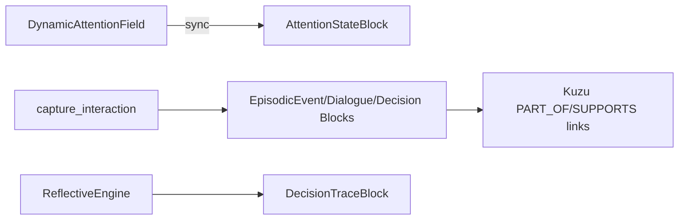

# CNexus 架构文档

> **持久记忆（愿景 / 对账 / 更新记录）：** [CNEXUS_PERSISTENT_MEMORY.md](./CNEXUS_PERSISTENT_MEMORY.md)

## 五层 + Validation 架构

| 层级 | 目录 | 职责 |
|------|------|------|
| Layer 1 Memory Infrastructure | `memory/`, `storage/` | MemoryManager + MemoryBlock + episodic 三存（Lance/Kuzu/JSON） |
| Layer 2 Cognitive Runtime | `runtime/` | 分层召回、注意力场、状态管理 |
| Layer 3 Personality Continuity | `core/personality/` | DNA、叙事自我、信念治理 |
| Layer 4 Stability Governance | `core/governance/` | 漂移检测、身份锚定、稳态控制 |
| Layer 5 Governance & Safety | `core/governance/safety/` | 写入门控、宪法、审计 |
| Validation Layer | `core/validation/` | 长期模拟、回归测试、可观测性 |

## 核心数据流

```
Capture → CaptureFilter → WriteGate → MemoryManager.capture_interaction()
              ├─ episodic trace → LanceDB + Kuzu
              └─ MemoryBlock (persona/intent/...) → JSON + Governance Hook

Recall  → HierarchicalRecallEngine (label priority + episodic fallback)
        → AttentionStateBlock hybrid snapshot + typed episodic triplets
        → Attention → ContextAssembly → LLM Context

Maintain → BlockLifecycleManager (decay/protect/compress) + episodic lifecycle
Governance → DriftDetector → IdentityAnchor → StabilityMetrics

## Block 类型化演进（v0.1）

| Block | 类型 | 策略 |
|-------|------|------|
| `attention_state` | `AttentionStateBlock` | Hybrid：DynamicAttentionField 实时场 + Block 持久 snapshot |
| `episodic_event` | `EpisodicEventBlock` | 显式 event schema + Lance/Kuzu 双写 |
| `episodic_dialogue` | `DialogueTraceBlock` | 对话轨迹，链接 event/decision |
| `episodic_decision` | `DecisionTraceBlock` | ReflectiveEngine 反思后自动写入 |

迁移：`python scripts/migrate_episodic_blocks.py --dry-run`


```

## 设计原则

- **Stability First**：优先保障身份连续性
- **Persistent Identity**：DNA + Narrative + Anchoring
- **Controlled Evolution**：慢速变更 + Guard + Approval
- **Governance Deterministic**：规则驱动 + 可审计
