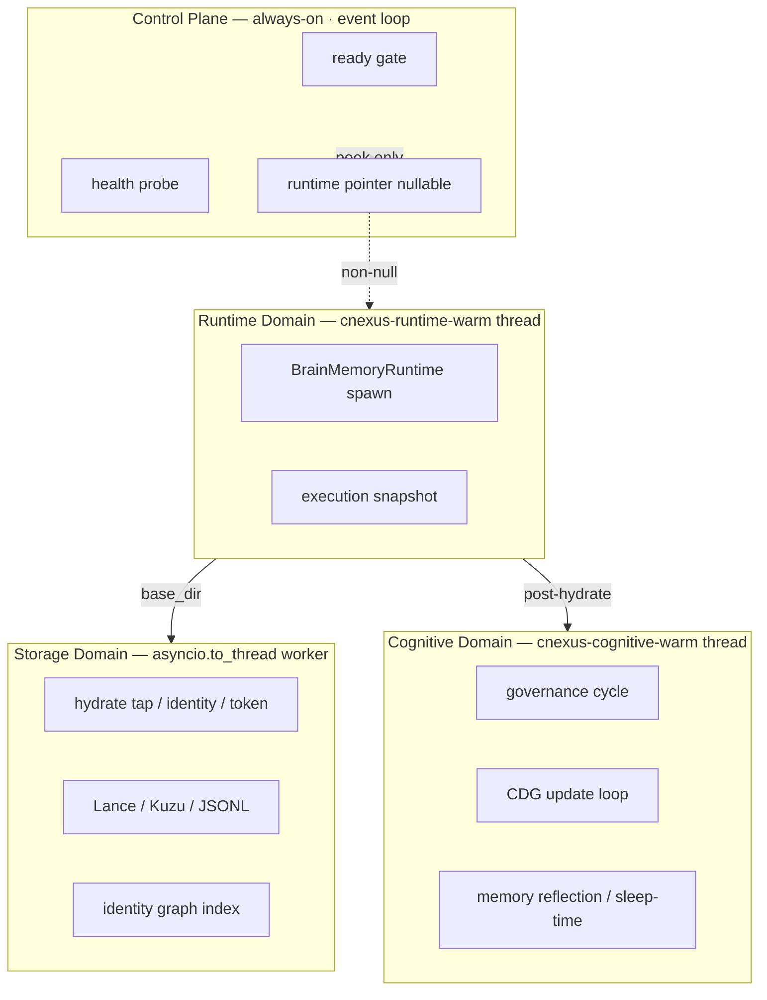
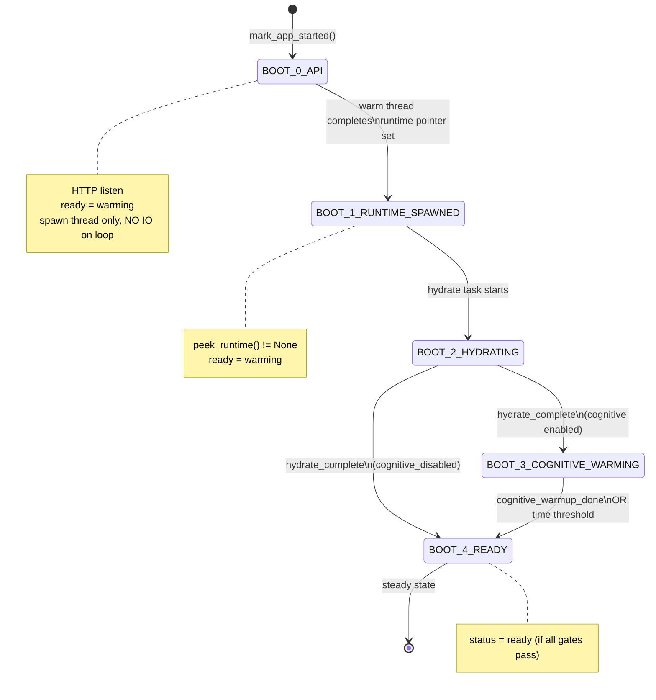
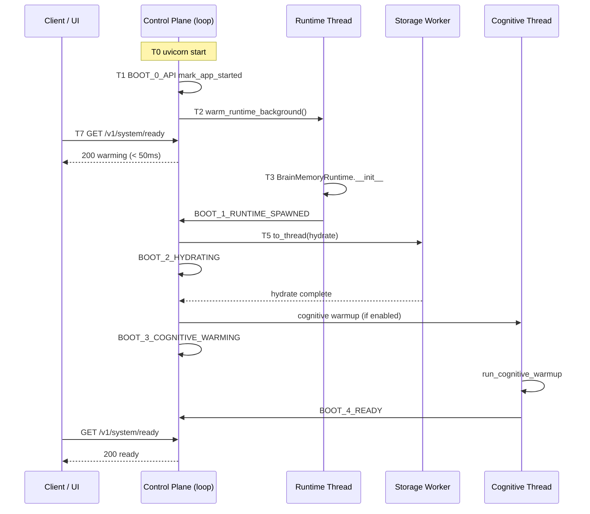

# CNEXUS Boot Protocol v3

> **统一入口**：[CNEXUS_SYSTEM_CONVERGENCE.md](./CNEXUS_SYSTEM_CONVERGENCE.md)（Boot + 三域 + L3 + Kernel 合一）  
> 前置：[CNEXUS_FIX_CONTRACT_v1.md](./CNEXUS_FIX_CONTRACT_v1.md)（L1/L2 已切断 event loop 劫持）

**版本**：`boot-protocol-v3`  
**权威实现**：`core/runtime/boot_protocol.py`  
**Ready 端点**：`GET /v1/system/ready` → `api/system_ready.py`

---

## 1. 四域划分（Boot Domain）

系统 boot 期间划分为四个执行域；**仅 Control Plane 运行在 asyncio event loop 上**。



| 域 | 线程/进程 | 允许操作 | 禁止操作 |
|----|-----------|----------|----------|
| **Control** | uvicorn event loop | 内存标志、`exists()`、WS accept | runtime 构造、disk scan、CDG、LLM |
| **Runtime** | `cnexus-runtime-warm` | `BrainMemoryRuntime.__init__` | 直接响应 HTTP |
| **Storage** | `asyncio.to_thread` pool | 全量 jsonl hydrate、identity index | 运行在 event loop |
| **Cognitive** | `cnexus-cognitive-warm` | governance、CDG、reflection | 阻塞 ready handler |

---

## 2. 状态机（BootPhase）



### 阶段枚举（API 字段 `boot_phase`）

| Phase | 值 | 含义 | `status` 典型值 |
|-------|-----|------|----------------|
| BOOT_0 | `boot_0_api` | API 已监听 | `warming` |
| BOOT_1 | `boot_1_runtime_spawned` | Runtime 指针已建立 | `warming` |
| BOOT_2 | `boot_2_hydrating` | Storage hydrate 进行中 | `warming` |
| BOOT_3 | `boot_3_cognitive_warming` | Cognitive warmup 进行中 | `warming` |
| BOOT_4 | `boot_4_ready` | 全引导完成 | `ready` |

### v2 → v3 字符串映射（只读兼容）

| v2（已废弃） | v3 |
|-------------|-----|
| `boot_1_state` | `boot_1_runtime_spawned` |
| `boot_2_hydrate` | `boot_2_hydrating` |
| `boot_2_cognitive` | `boot_3_cognitive_warming` |
| `boot_3_optimized` | `boot_4_ready` |

---

## 3. 状态迁移规则（调度契约）

```text
BOOT_0 → BOOT_1
  触发：cnexus-runtime-warm 线程 _create_runtime() 成功
  条件：runtime pointer 非空
  禁止：event loop 上执行 __init__

BOOT_1 → BOOT_2
  触发：_hydrate_execution_tap() 开始
  条件：peek_runtime() != None

BOOT_2 → BOOT_3
  触发：mark_hydrate_complete() 且 cognitive 未禁用
  条件：hydrate worker 返回（success 或 skipped 均推进）

BOOT_2 → BOOT_4
  触发：mark_hydrate_complete() 且 cognitive_disabled()

BOOT_3 → BOOT_4
  触发：mark_cognitive_warmup_done()
  或：CNEXUS_BOOT_COGNITIVE_TIMEOUT_SEC 超时（scheduler 兜底）

失败策略：每阶段可失败、可重试；失败不阻塞 HTTP；ready 保持 warming。
```

---

## 4. Ready 规则（强化版 · v3）

**唯一权威函数**：`evaluate_system_ready()` in `boot_protocol.py`

```text
status = "ready"  IFF  ALL:
  1. control_plane_alive   (_APP_STARTED ∧ http=listening)
  2. runtime_pointer       (peek_runtime() is not None)
  3. NOT runtime_warming   (is_runtime_warming() == False)
  4. boot_phase            == BOOT_4_READY
  5. token_valid ∧ license_valid
  6. memory_ok             (fast_health: ready|degraded|initializing)
  7. ws_alive              (runtime pointer exists → ws: alive)

status = "warming"  IF  boot_phase < BOOT_4 OR runtime_warming
status = "not_ready" ELSE (storage hard fail in strict deploy)
```

与 v2 的关键差异：**`status=ready` 仅在 `BOOT_4_READY`**，不再在 BOOT_1/2/3 提前放行。

---

## 5. 时间线（与 Fix Contract T0–T9 对齐）



---

## 6. 代码锚点（单一真相源）

| 职责 | 文件 | 符号 |
|------|------|------|
| 阶段枚举 + 迁移 | `core/runtime/boot_protocol.py` | `BootPhase`, `mark_*`, `evaluate_system_ready` |
| Ready payload | `brain-memory-ui/api/system_ready.py` | `system_ready_payload` |
| Runtime 构造 | `brain-memory-ui/api/deps.py` | `warm_runtime_background`, `_create_runtime` |
| Hydrate | `brain-memory-ui/api/main.py` | `_hydrate_execution_tap` |
| Cognitive warmup | `brain-memory-ui/api/deps.py` | `start_cognitive_warmup_background` |
| 桌面 Rust 轮询 | `src-tauri/src/boot_sequence.rs` | `runtime_system_ready()` |

**禁止**：在 `system_ready_payload` 之外自行解释 `boot_phase` 决定 UI show。

---

## 7. 与桌面 BootState 映射

| Rust `BootState` | Boot Protocol v3 | 说明 |
|------------------|------------------|------|
| RuntimeSpawning | BOOT_0 – BOOT_1 | sidecar 已 spawn，runtime 构造中 |
| RuntimeReady | BOOT_4 + `status=ready` | Rust poll 见 `ready` 字符串 |
| UiRenderAllowed | BOOT_4 + JS `probeRuntimeReady` | WS 握手 |
| FloatWindowShown | steady | 悬浮窗已显示 |

---

## 8. 后续演进（v3 解锁）

| 项 | v3 如何约束 |
|----|------------|
| **L3 time-sliced governance** | 仅在 `BOOT_3` 域内调度；完成 → `BOOT_4` |
| **三域进程拆分** | 域边界已定义；sidecar = Runtime+Storage+Cognitive |
| **non-hang kernel** | Control Plane 可独立为最小进程，仅持 flags |

---

## 9. 验证

```powershell
$env:PYTHONPATH="brain-memory-ui;."
python -m pytest tests/test_boot_protocol_v3.py tests/test_boot_protocol_v2.py -q
```

Ready 端点必须在 `BOOT_0`–`BOOT_3` 全程返回 HTTP 200 + `warming`（禁止 timeout）。
