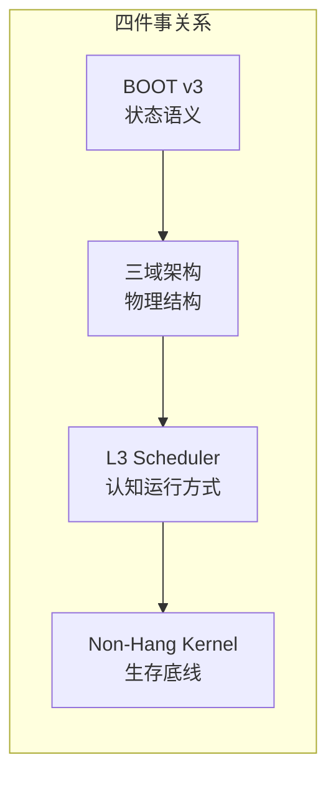
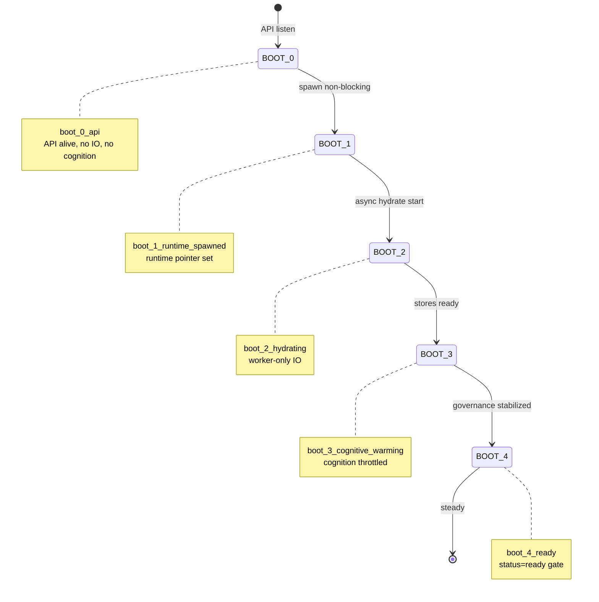
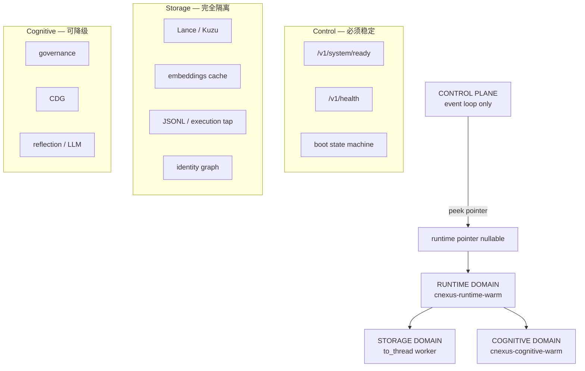
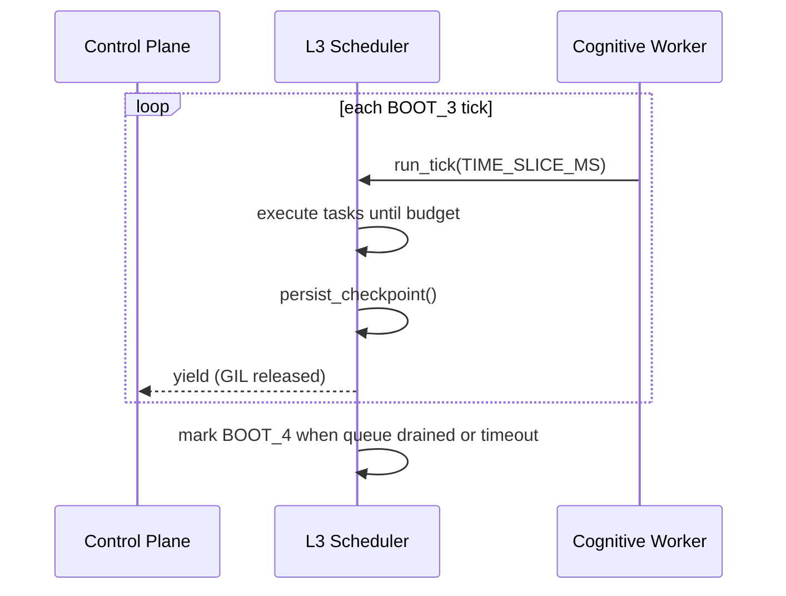
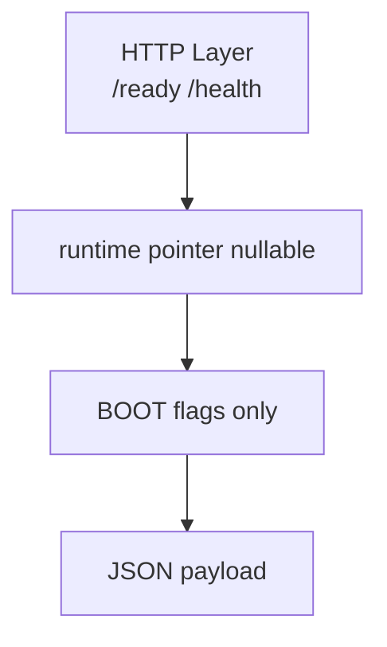
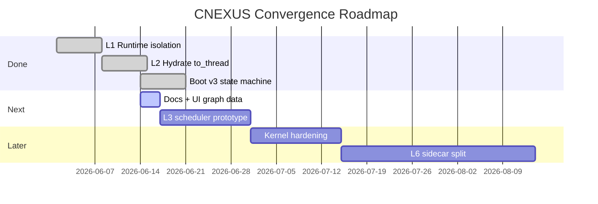

# CNEXUS System Convergence — 四域合一设计

> **Phase Shift**：从 Runtime Engine → Operating System for Cognition  
> 本文档将 Boot v3、三域架构、L3 Scheduler、Non-Hang Kernel **收敛为单一演进路径**，避免多套图/多套语义分裂。

| 文档 | 角色 |
|------|------|
| [CNEXUS_FIX_CONTRACT_v1.md](./CNEXUS_FIX_CONTRACT_v1.md) | 尸检反演 + P0 隔离（L1/L2 已实施） |
| **本文档** | 系统级抽象收敛（状态语义 + 物理结构 + 调度 + 生存底线） |
| [CNEXUS_BOOT_PROTOCOL_v3.md](./CNEXUS_BOOT_PROTOCOL_v3.md) | Boot 实现细节与代码锚点 |

**前端可视化数据**：`brain-memory-ui/frontend/lib/systemConvergence.ts`  
**Python 契约**：`core/runtime/control_plane_kernel.py` · `core/runtime/l3_scheduler.py`

---

## 0. 设计原则（全系统）

```text
Boot = 控制面永远可响应 + runtime/cognition 异步演化
API 不运行智能，只调度智能
```



---

# 一、Boot Protocol v3 — 状态机（Docs + UI）

## 1.1 主状态流转



### 线性视图（与实现字符串对齐）

```text
BOOT_0_API          (boot_0_api)
    │ spawn (non-blocking, cnexus-runtime-warm)
    ▼
BOOT_1_RUNTIME_SPAWNED  (boot_1_runtime_spawned)
    │ async hydrate (asyncio.to_thread)
    ▼
BOOT_2_HYDRATING    (boot_2_hydrating)
    │ memory + execution stores ready
    ▼
BOOT_3_COGNITIVE_WARMING  (boot_3_cognitive_warming)
    │ governance stabilized OR timeout budget
    ▼
BOOT_4_READY        (boot_4_ready)
```

## 1.2 状态语义表（权威）

| State | API `boot_phase` | 含义 | IO | Cognition |
|-------|------------------|------|-----|-----------|
| BOOT_0 | `boot_0_api` | API alive | ❌ | ❌ |
| BOOT_1 | `boot_1_runtime_spawned` | runtime 已 spawn | ❌ | ❌ |
| BOOT_2 | `boot_2_hydrating` | 数据 hydrate 中 | ✔ worker only | ❌ |
| BOOT_3 | `boot_3_cognitive_warming` | cognition warming | ✔ | ✔ 限速 |
| BOOT_4 | `boot_4_ready` | stable ready | ✔ | ✔ |

## 1.3 Ready 判定（全系统统一）

**唯一函数**：`evaluate_system_ready()` · `core/runtime/boot_protocol.py`

```python
READY = (
    boot_phase == BOOT_4_READY
    and runtime_pointer is not None
    and control_plane_alive is True
    and not runtime_warming
    and token_valid and license_valid
    and memory_ok  # fast_health only
)
```

| `status` | 条件 |
|----------|------|
| `ready` | 上式全部满足 |
| `warming` | `boot_phase < BOOT_4` 或 `runtime_warming` |
| `not_ready` | BOOT_4 但 storage/token 硬失败 |

---

# 二、三域架构 — Control / Cognitive / Storage

> Runtime Domain 作为 **执行容器**，桥接 Control 与 Storage/Cognitive。



## 2.1 ASCII 结构图

```text
                ┌──────────────────────┐
                │   CONTROL PLANE      │
                │──────────────────────│
                │ /ready /health       │
                │ runtime pointer      │
                │ boot state machine   │
                └─────────┬────────────┘
                          │ peek only
        ┌─────────────────┼─────────────────┐
        ▼                 ▼                 ▼
┌────────────────┐ ┌────────────────┐ ┌────────────────┐
│ COGNITIVE      │ │ RUNTIME        │ │ STORAGE        │
│ DOMAIN         │ │ DOMAIN         │ │ DOMAIN         │
│────────────────│ │────────────────│ │────────────────│
│ governance     │ │ BrainMemory    │ │ lance / kuzu   │
│ CDG updates    │ │ execution tap  │ │ embeddings     │
│ reflection     │ │ state builder  │ │ jsonl logs     │
│ warmup cycles  │ │ hydration hook │ │ identity graph │
└────────────────┘ └────────────────┘ └────────────────┘
```

## 2.2 域边界规则

| 域 | 允许 | 禁止 |
|----|------|------|
| **Control** | 内存标志、`exists()`、WS accept | disk IO、embedding、LLM、`_runtime_lock` 在 ready 路径 |
| **Runtime** | `__init__`、pointer 发布 | 在 event loop 上构造 |
| **Storage** | batch read/write、full scan | 阻塞 event loop |
| **Cognitive** | LLM、CPU、governance | 无 time-slice 的长独占（→ L3） |

---

# 三、L3 Scheduler — Time-Sliced Governance

> **目标**：`run_governance_cycle()` 从 blocking function → cooperative scheduler  
> **状态**：契约 + prototype skeleton（`core/runtime/l3_scheduler.py`）  
> **解锁条件**：Boot v3 阶段门控已就位（BOOT_3 域内调度）

## 3.1 旧模型 vs 新模型

```text
❌ 旧（危险）                    ✔ 新（L3）
run_governance_cycle()          L3GovernanceScheduler.run_tick()
  ├── CDG (sync)                  ├── pop task
  ├── reflection (sync LLM)       ├── execute slice ≤ N ms
  ├── sleep (blocking)            ├── yield / checkpoint
  └── maintain_memory             └── defer LLM to future
```

## 3.2 Tick 结构



| Task | Slice 类型 | 预算 |
|------|-----------|------|
| CDG update | CPU slice | ≤ 20ms |
| memory reflect | async slice | deferred |
| LLM call | deferred future | 不占 tick |
| storage sync | batch IO | worker thread |

## 3.3 已接入（BOOT_3 tick runtime）

```text
cnexus-cognitive-warm thread
  → run_cognitive_warmup_ticks(runtime)
  → CognitiveWarmupAdapter.tick() loop (yield 20ms)
  → L3GovernanceScheduler.run_tick(slice_ms)
  → boot.boot.l3 in /v1/system/ready
  → execution_trace.jsonl (per tick)
```

| 模块 | 路径 |
|------|------|
| Adapter | `core/runtime/cognitive_warmup_adapter.py` |
| Scheduler | `core/runtime/l3_scheduler.py` |
| BOOT glue | `boot_protocol.advance_boot_cognitive_tick()` |
| Trace | `core/runtime/execution_trace.py` |

---

# 四、Non-Hang Kernel — 生存底线

> **目标**：cognition 崩溃时，API 仍 **< 200ms** 响应 `/v1/system/ready`  
> **实现边界**：`core/runtime/control_plane_kernel.py`



## 4.1 Kernel 约束

```text
✔ no runtime init in request path
✔ no IO in event loop
✔ no lock in control plane read path
✔ no cognitive import in ready handler
```

## 4.2 保证矩阵

| 属性 | 保证 |
|------|------|
| 永不 hang（ready 路径） | ✔ L1/L2 + Kernel 契约 |
| 永不依赖 cognition 响应 ready | ✔ `peek_runtime` only |
| 永远可响应（warming OK） | ✔ HTTP 200 |
| 可降级运行 | ✔ BOOT_0–3 warming |

---

# 五、演进路径（建议顺序）



| 顺序 | 项 | 产出 |
|------|-----|------|
| **① 当前** | Boot v3 + 三域图 | 本文档 + `systemConvergence.ts` + UI rail |
| **② 下一步** | L3 scheduler 可运行 prototype | `l3_scheduler.py` 接入 `run_cognitive_warmup` |
| **③ 最后** | Kernel hardening + L6 sidecar | 进程级 Control/Cognitive 拆分 |

---

# 六、代码与 UI 锚点

| 能力 | Python | TypeScript |
|------|--------|------------|
| Boot 状态机 | `boot_protocol.py` | `systemConvergence.ts` → `BOOT_PHASES` |
| Ready 判定 | `evaluate_system_ready()` | `resolveReadyDisplay()` |
| 三域图 | — | `THREE_DOMAIN_GRAPH` |
| L3 契约 | `l3_scheduler.py` | `L3_SCHEDULER_SPEC` |
| Kernel 契约 | `control_plane_kernel.py` | — |
| UI 进度条 | — | `BootPhaseRail.tsx` |

---

# 七、验证

```powershell
$env:PYTHONPATH="brain-memory-ui;."
python -m pytest tests/test_boot_protocol_v3.py -q
```

Ready 在 BOOT_0–BOOT_3 必须 **HTTP 200 + warming**，禁止 client timeout。
