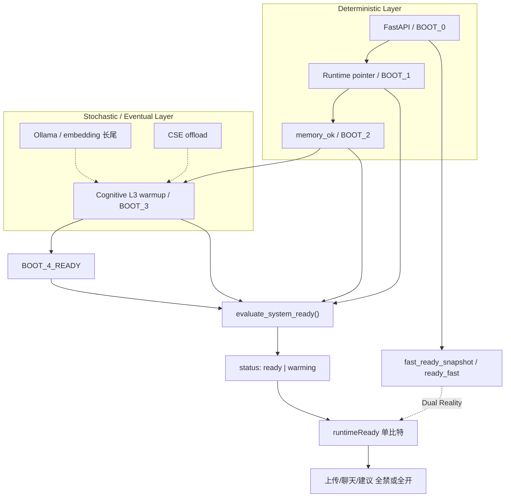
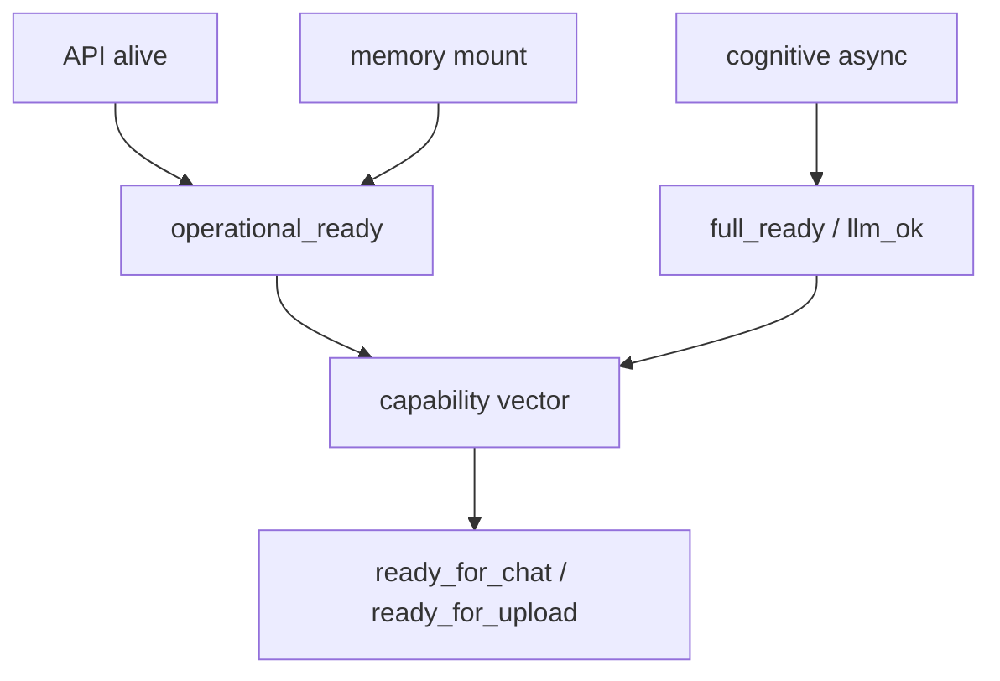

# CNexus Runtime — 工程判决与前因后果（深度剖面）

**日期：** 2026-06-16  
**阶段：** Architecture Correction Phase（架构纠错，非 debug）  
**性质：** 对账确认 + 因果链 + 前因后果 — **不含 PR 实现**  
**撰写人：** Auto（Cursor AI 编码助手）

---

## 零、判决摘要（不可逆事实）

对账已将问题从「哪里坏了」推进到「**稳定性定义本身错了**」。以下三条为 **工程判决**，非待证假设：

| # | 不可逆事实 | 代码证据 |
|---|-----------|---------|
| F1 | **`BOOT_4_READY` 是组合 AND 门，不是单一阶段** | `evaluate_system_ready()` 要求 `phase==boot_4` ∧ `!_cognitive_warmup_blocks_ready()` ∧ `memory_ok` ∧ … |
| F2 | **Fast/Full 双轨 API = Dual Reality（双现实）** | 默认 `fast_ready_snapshot` → `ready_fast`；`?mode=full` → `evaluate_system_ready()` |
| F3 | **SKIP=1 已构成 P0 因果证明** | `cognitive_disabled()` → `mark_cognitive_warmup_done(bypass_causal=True)` → 秒级收敛 |

**工程级一句话：**

> **Blocking Dependency Error (BDE-1)** — 系统稳定性被绑定在 **非确定性子系统（cognitive warmup）的同步完成事件** 上；再修观测层无法改变动力层语义。

---

## 一、前因：设计决策如何种下故障

### 1.1 产品意图（合理）

桌面 CNexus 需要：

- 本地 API 快速可响应（悬浮窗、工作台）
- 记忆可持久化（LanceDB / Kuzu）
- 认知能力逐步增强（Ollama、embedding、CSE、L3 governance）

→ 天然是 **Hybrid Cognitive Runtime System (HCRS)**：多子系统、多时间尺度、部分随机性。

### 1.2 实现选择（结构性误判）

为「防止假 online、防止未 warm 就写记忆」，引入了 **Boot Protocol v3**：

```text
BOOT_0 → BOOT_1 → BOOT_2 → BOOT_3 → BOOT_4
                              ↑
                    单一出口：evaluate_system_ready() == "ready"
```

隐含公理：

```text
SYSTEM_READY = ALL_SUBSYSTEMS_READY   （同步布尔）
```

→ 把 HCRS **实现成 Deterministic Boot-State Machine (DBSM)**。

### 1.3 并行加速路径（未收敛的妥协）

同一时期为「首屏快」加了 **Fast-Path v1/v2/v3**：

- 默认 `/v1/system/ready` → `ready_fast`（不跑 full gate）
- 上传/聊天门控 → `?mode=full` + `runtimeReady`

→ **同一产品、两条「现实」**：快路径说「壳活了」，慢路径说「还不能用」。

### 1.4 前因链（压缩）

```text
[意图] 认知 + 记忆 + API 一体
    → [设计] 线性 Boot + 单一 ready 布尔
    → [妥协] Fast-Path 与 Full-Path 并存
    → [观测] 多 probe 前端各自解读
    → [交付] 构建不稳定放大版本噪声
```

**前因结论：** 不是某次 commit 写错，而是 **READY 语义从第一天就按「编译完成」建模，而运行时是「逐步变强」**。

---

## 二、机制：故障如何在代码中必然发生

### 2.1 组合门（F1 展开）

`evaluate_system_ready()` 等价于：

```text
ready ⇔ app_started
     ∧ ¬runtime_warming
     ∧ boot_phase == BOOT_4_READY
     ∧ ¬_cognitive_warmup_blocks_ready()    // L3 队列、adapter、event_bus idle…
     ∧ runtime_present
     ∧ memory_ok
     ∧ token/license valid
```

**BOOT_4 在此不是「阶段名」，而是「全子系统 AND 通过」的别名。**

`_cognitive_warmup_blocks_ready()` 还叠加 v3/v4/v5 tier 的 bus idle、cluster health 等 — **最慢检查项主导 ready**。

### 2.2 非确定性子系统（BDE-1 宿主）

| 子系统 | 代码路径 | 时间特征 |
|--------|---------|---------|
| API / Uvicorn | `mark_app_started` | 秒级，确定 |
| Runtime warm | `warm_runtime_background` → `_create_runtime` | 数秒～数十秒；Kuzu/路径失败则 **永不 BOOT_4** |
| Hydrate | `mark_hydrate_complete` | 与存储 IO 相关 |
| Cognitive | `run_cognitive_warmup_ticks` / L3 adapter | **10s～120s+**；失败则 log「holding BOOT_3」 |
| 120s escape | `maybe_advance_cognitive_timeout` | **时间替代状态** — `t≥120s` 则 `bypass_causal` 进 BOOT_4（internal/personal） |

**逻辑必然：** 任一子系统慢于 UI 期望（3～10s）→ `status:"warming"` → 前端 `runtimeReady=false` → **全功能假离线**。  
这不是 intermittent bug，是 **门控公理的直接推论**。

### 2.3 双现实（F2 展开）

```text
请求 A: GET /v1/system/ready          → fast_ready_snapshot → status: "ready_fast"
请求 B: GET /v1/system/ready?mode=full → evaluate_system_ready → status: "warming"
```

同一时刻、同一进程、**两种「是否就绪」答案**。

前端映射：

- `MindStore.probeRuntime` → 常走 **fast**
- `probeRuntimeFull` / FloatMonitor full leg → **full**
- `classifyReadyPayload`: `ready_fast` → phase `"warming"`（已收紧，但 fast 仍影响 reachable/boot_phase 感知）

**后果命名：** Dual Reality Runtime — **语义分裂**，不是时钟不同步。

### 2.4 因果证明（F3 展开）

```text
CNEXUS_BOOT_SKIP_COGNITIVE=1
  → cognitive_disabled() == True
  → mark_runtime_spawned / mark_hydrate_complete 路径
  → mark_cognitive_warmup_done(bypass_causal=True)
  → BOOT_4_READY 立即提交
  → evaluate_system_ready() 可返回 "ready"（若 memory/runtime 亦 OK）
```

开发机 SKIP 实验 **已做**：API ready、memory/stats 200。  
这在实验设计上等价于 **对 cognitive gate 做 ablation** — P0 由 cognitive 主导 **成立**。

### 2.5 观测层放大（P1 — 后果加速器）

| 机制 | 后果 |
|------|------|
| 多 probe 源（≥5） | 同一后端状态，多种 UI 解释 |
| `RUNTIME_PROBE_TIMEOUT_MS=8000` | 冷启动/阻塞时 abort → **一次即 offline** |
| FloatMonitor 串行 fast+full | 单次 probe 可达 16s 窗口 |
| `canUseRuntimeApi` ∧ `runtimeReady` | 与 full gate 硬绑定，无 operational 层 |

→ 在 BDE-1 之上叠加 **抖动、假离线、状态分裂**；修 probe 只改 **投影**，不改 **门**。

### 2.6 交付噪声（P2 — 后果混淆器）

BAT exit -1、bundle 锁、旧 `%LOCALAPPDATA%` → 「修了无效」常是 **未装同版本包**。  
不创造 BDE-1，但 **阻止团队对 F1–F3 形成稳定共识**。

---

## 三、后果：用户、工程与三次修复失败

### 3.1 用户可感知后果

| 现象 | 机制后果 |
|------|---------|
| 长期「正在启动」 | full gate 等 BOOT_4 + cognitive；0～120s 内必 warming |
| 侧栏/悬浮窗状态不一致 | Dual Reality + 多 probe |
| 上传/聊天失败 | `runtimeReady` 单比特为 false |
| 「进程在跑但不能用」 | API 进程 alive ≠ `evaluate_system_ready=="ready"` |
| 偶发突然能用 | 120s bypass / warm 完成 / 探测窗口重叠 |

### 3.2 工程过程后果（为何「修三天仍冲突」）

```text
轮次 1：收紧前端，防 ready_fast 假 online
  → 后果：假 online 减少，长期 warming 暴露（症状转移）

轮次 2：reason/progress、UTF-8、Kuzu、memory/stats offload
  → 后果：观测更清晰，ready 仍 false（动力层未动）

轮次 3：构建续跑、TS 修复、新 NSIS
  → 后果：交付改善，用户环境仍 BDE-1（结构未动）
```

**共同模式：** 修改 **Projection Layer**（字段、probe、日志、包），未修改 **State Semantics**（`ready` 仍为单一布尔 ∧ BOOT_4）。

### 3.3 120s timeout 的伪解后果

`maybe_advance_cognitive_timeout` 在 internal 部署下：

```text
t < 120s  → 用户：系统坏了
t ≥ 120s  → 系统：assume ready（bypass_causal）
```

这叫 **Temporal Substitution of State Correctness** — 用时间代替「子系统是否真的收敛」。  
不解决 BDE-1，只把「永远 warming」变成「两分钟后也许能用」。

### 3.4 若 SKIP=1 仍失败（并列次因链）

此时 BDE-1 **不是唯一解释**，须并行：

- Runtime warm init 异常（stderr、`record_runtime_warm_attempt`）
- 文件锁 / Kuzu / LanceDB（Procmon）
- sidecar `env_remove("PYTHONPATH")` 后 embedded python 路径异常（特定机器）

**判决分支：**

```text
SKIP=1 → full ready < 30s ?
  YES → BDE-1 定案，进入架构纠错
  NO  → 暂停前端，查 I/O / 打包 / sidecar exit code
```

---

## 四、因果网络图（Dependency Graph — 真实结构）

### 4.1 当前实现（错误依赖方向）



**关键边：** `COG → GATE` 为 **硬阻塞边**（BDE-1）；`FAST -.-> UI` 为 **语义分裂边**。

### 4.2 SKIP=1  ablation（因果实验）


**证明：** 移除 `COG → GATE` 硬边后，系统快速稳定 → **阻塞依赖在 cognitive gate**。

### 4.3 目标形态（仅语义，非本 PR）



**注：** 代码库 **尚无** `operational_ready`、`ready_for_chat` 等字段（grep 零匹配）— 结构层缺口 **未开工**。

---

## 五、与「硬核验证级分析」的逐项对账

| 你的论断 | 判决 |
|---------|------|
| BOOT_4 是组合门，非阶段 | ✅ 与 `evaluate_system_ready` + `_cognitive_warmup_blocks_ready` 一致 |
| 任一子系统慢 → 永远不 ready | ✅ 逻辑必然；120s 为时间逃逸，非收敛 |
| Fast/Full = Dual Reality | ✅ `fast_ready_snapshot` vs full path |
| SKIP=1 = causal proof | ✅ ablation 成立 |
| BDE-1 为唯一主因（在 SKIP 通过前提下） | ✅ |
| 错误是 `SYSTEM_READY = ALL_SUBSYSTEMS_READY` | ✅ 架构公理级 |
| 不是 bug，是 model mismatch failure | ✅ |
| 120s = temporal substitution | ✅ `maybe_advance_cognitive_timeout` + `bypass_causal` |
| 已进 Architecture Correction Phase | ✅ F1–F3 已闭合，缺的是 **语义重构** 而非更多 log |
| 死锁环 | ⚠️ 改为 **AND 门 + 最慢子系统** 更准确 |

---

## 六、前因 → 机制 → 后果 总链（一张表）

| 阶段 | 内容 |
|------|------|
| **前因** | HCRS 产品需求 + DBSM 实现选择 + Fast/Full 双轨妥协 |
| **机制** | `ready = ∧(子系统)`；cognitive 非确定性；Dual Reality API；前端多 probe |
| **直接后果** | 0–120s warming；状态分裂；全功能假离线 |
| **修复后果** | 观测层改善；动力层不变；用户体感仍不稳定 |
| **实验后果** | SKIP=1 证明 cognitive gate 主导 P0 |
| **工程判决** | BDE-1 + model mismatch；进入架构纠错，非 debug |

---

## 七、当前阶段定义

```text
┌────────────────────────────────────────────────────────┐
│  已过：现象争论 → 多层怀疑 → 单因果链 → 代码对账      │
│  现处：Architecture Correction Phase                   │
│  未做：operational_ready / capability SSOT（代码零实现）│
│  禁止：继续叠加前端 probe（放大 P1，不触 P0）          │
└────────────────────────────────────────────────────────┘
```

**稳定性定义错误的表现：**

> 不是「Runtime 没修好」，而是 **「修好」的标准被定义为不可能在 stochastic 子系统上稳定满足的布尔事件**。

---

## 八、三分法排查与前因后果的对应（执行时只读此表）

| 维度 | 查什么 | 若异常说明什么 | 与 BDE-1 关系 |
|------|--------|---------------|--------------|
| **外→内：环境** | Procmon、stderr、exit code | 次因链；warm init 失败 | 并列 P0'，非否定 BDE-1 |
| **静→动：协议** | full ready JSON；SKIP 对比 | SKIP 通 → BDE-1 定案 | **主实验** |
| **接口→逻辑：UI** | probe 源、8s timeout | P1 后果，非根因 | 症状确认 |

---

## 九、结语（工程判决闭合）

1. **三条不可逆事实（F1–F3）在对账中成立**，SKIP 实验赋予 P0 **因果级** 而非统计级证据。  
2. **长期 warming 是逻辑必然**，不是「还有一个 bug 没找到」。  
3. **Dual Reality API** 解释「偶尔像好了」— 是 **语义分裂**，同步修复无效。  
4. **120s bypass** 是 **时间换状态**，不是 Progressive Capability。  
5. **代码中不存在** `operational_ready` / `ready_for_chat` — 结构改造 **尚未开始**；此前所有改动均属观测/环境/交付层。  
6. **下一步性质**：改 **状态语义与依赖图**，不是再加 log 或 probe。

---

**相关文档**

- `docs/runtime-status-report-20260616.md` — 单因果链定界  
- `docs/runtime-structural-reconciliation-20260616.md` — 三维对账  

**撰写人：** Auto（Cursor AI 编码助手）  
**日期：** 2026-06-16
