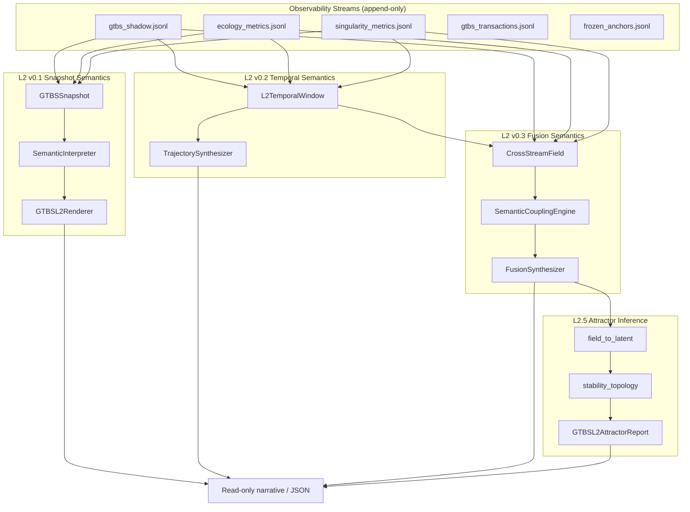
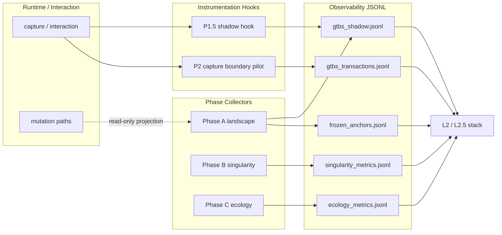
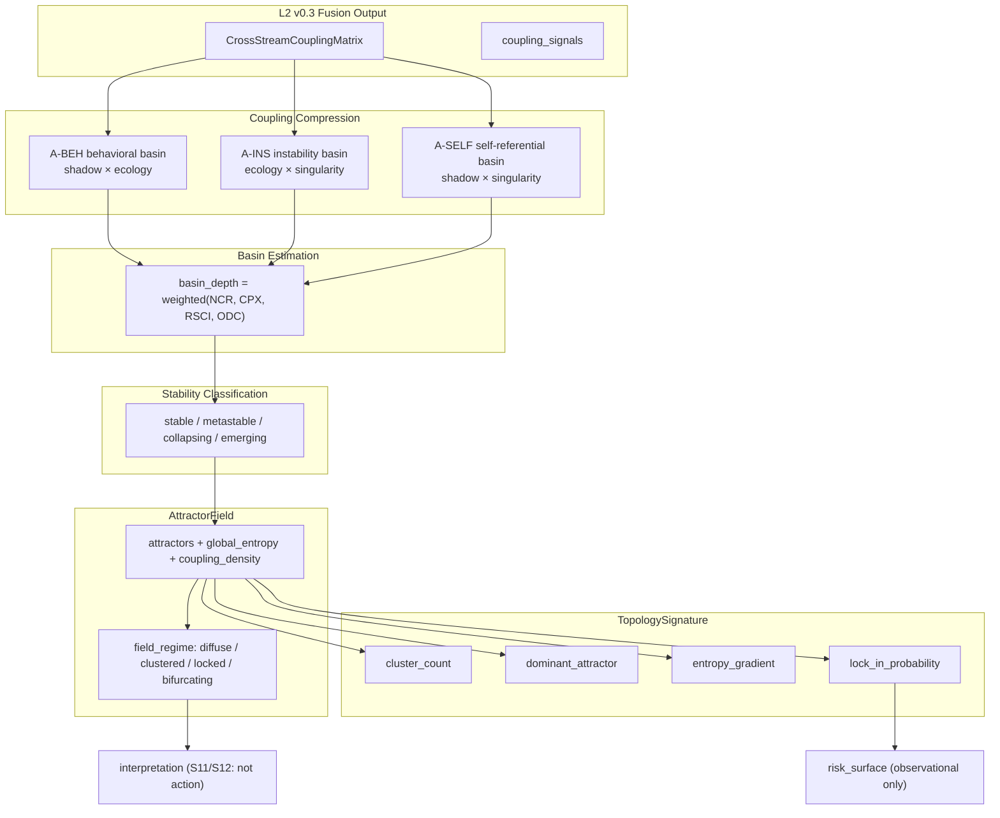
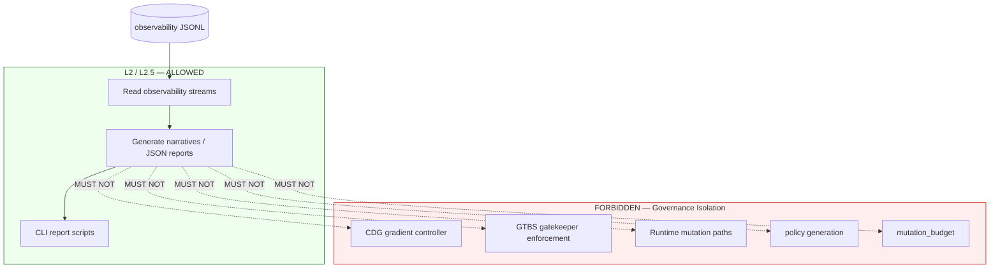

# GTBS / G1 Architecture Graphs — Snapshot v0.3

Frozen diagrams for the L2 / L2.5 observational cognition stack.  
See [GTBS_SYSTEM_SNAPSHOT_v0.3.md](./GTBS_SYSTEM_SNAPSHOT_v0.3.md) for full context.

---

## 1. L2 pipeline graph

---

## 2. Observability stream graph

---

## 3. Attractor field diagram

---

## 4. Governance isolation boundary

