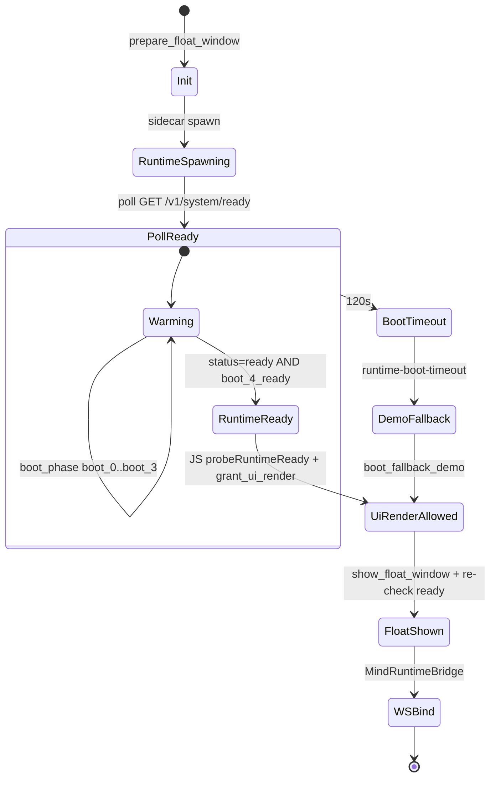

# CNexus 桌面启动状态机

> **Boot Protocol v3**：`docs/CNEXUS_BOOT_PROTOCOL_v3.md`  
> **Ready 协议**：`packaging/prebuild-rc/RUNTIME_READY_PROTOCOL.md`

## 双状态机关系

| 层 | 所有者 | 范围 |
|----|--------|------|
| **BootPhase** (v3) | Python `boot_protocol.py` | Runtime 进程内四域引导 |
| **BootState** (Rust) | `boot_state.rs` | 桌面 UI 进程 show 门控 |



## BootPhase v3（Runtime 进程）

```text
BOOT_0_API → BOOT_1_RUNTIME_SPAWNED → BOOT_2_HYDRATING
    → BOOT_3_COGNITIVE_WARMING → BOOT_4_READY
```

仅 `BOOT_4_READY` + `status=ready` 时，Rust `runtime_system_ready()` 返回 true。

## BootState 枚举（Rust UI 进程）

| 值 | 状态 | 允许 show? |
|----|------|------------|
| 0 | Init | ❌ |
| 1 | RuntimeSpawning | ❌ |
| 2 | RuntimeReady | ❌ |
| 3 | UiRenderAllowed | ✅ |
| 4 | FloatWindowShown | — |

## 关键：不再 fake ready

超时 **不会** emit `runtime-ready`；悬浮窗仅 Demo fallback 或真正 `BOOT_4` + `status=ready` 后显示。
